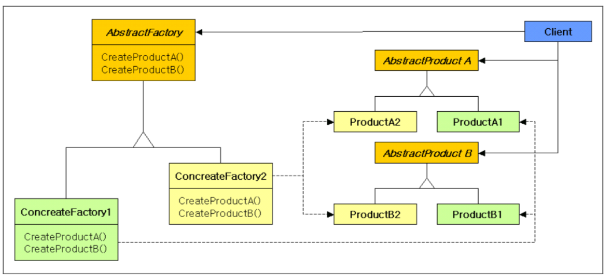

# Creational Pattern

## \#Abstract Factory

### 그림을 이해하자 !!

1. Client는 AbstractFactory를 바라본다.
2. Client가 AbstarctProduction A, B를 생성하고 싶어한다. 
3. AbstarctProduction 을 실제 생성하는 아이는 AbstarctFactory이다. \(ConcreateFactory1, 2\)
4. 즉, AbstractProduct를 생성하기 위해서는 AbstarctFactory

### Source Code

