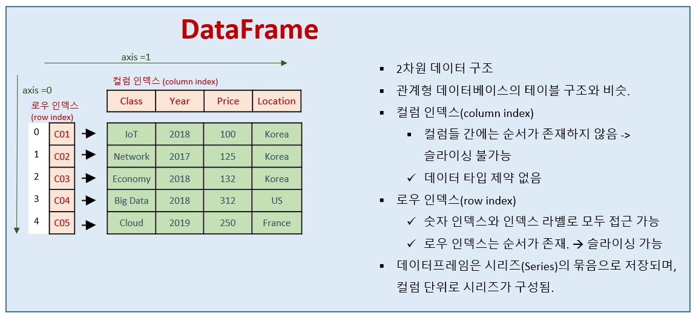
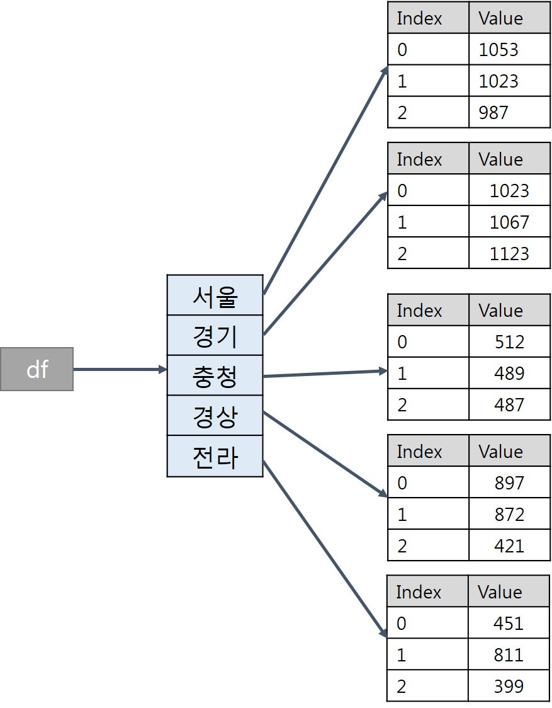
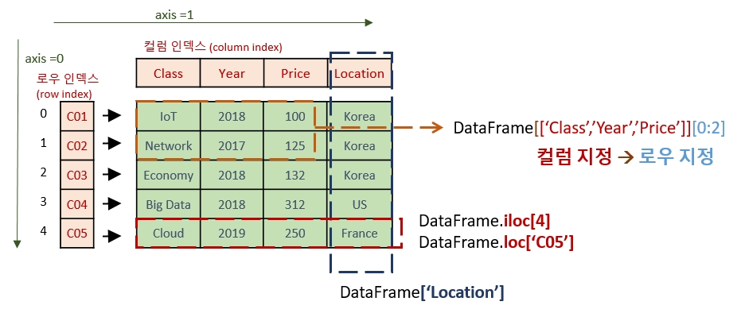

# Pandas 개요 및 DataFrame

## Pandas <a id="2.-Pandas-&#xC8FC;&#xC694;-&#xB370;&#xC774;&#xD130;-&#xD0C0;&#xC785;"></a>

### DataFrame



### Data Frame Creation

1\) data : dataFrame에 저장할 데이터 \(numpy ndarray, dict, DataFrame 등 여러 형태 가능\)  
2\) index : 행\(row\) 이름, 기본값 = 0부터 1씩 증가하는 정수  
3\) index : 행\(row\) 이름, 기본값 = 0부터 1씩 증가하는 정수  
4\) dtype : 데이터 형태\(type\), 만약 지정하지 않으면 파이썬이 자동으로 값의 형태를 보고 결정  
5\) copy : 입력 데이터를 복사할지 지정. 디폴트는 False 임. \(복사할 거 아니면 메모리 관리 차원에서 디폴트인 False 설정 사용하면 됨\)  


```python
import pandas as pd
from pandas import Series, DataFrame

# 1. 2차원 데이터 생성
# 기본적으로 DataFrame은 2차원 배열과 비슷하며, Column기준으로 Series로 구성
df1 = DataFrame(
                [[1,2,3],
                ['Kim', 'Park', 'Choi'],
                [1.5 , 2.3 , 5.6]]
                )
                
# 2. 로우 인덱스와 컬럼 인덱스 설정
df1.index = ['A','B','C']
df1.columns = ['a','b','c']

# 1,2를 한꺼번에 하기
df1 = pd.DataFrame(
                    {'a' : [1,2,3],
                    'b' : ['Kim','Park','Lee'],
                    'c' : [2.2,6.4,3.3]}, index = ['A','B','C']
                    )

# 3. 사전 타입 데이터를 이용하여 데이터 프레임 생성하기
인구통계 = {'서울': [1053.5, 1023, 987],
        '경기':[1023, 1067, 1123],
        '충청':[512,489,487],
        '경상':[897, 872, 811],
        '전라':[451, 421, 399]
      }
df3 = DataFrame(인구통계)


```




### DataFrame 속성 조회하기 \(속성을 조회할 때에는 \(\)를 사용하지 않으니 유의하기 바람.\)

```python
# df3에 로우 인덱스를 2016, 2017, 2018로 만들기
df3.index = [2016,2017,2018]


#        서울	    경기	    충청 경상	전라
#2016	1053.5	    1023	512	897	451
#2017	1023.0	    1067	489	872	421
#2018	987.0	    1123	487	811	399

##################### ##################### #####################

#1. T (Transpose) : 행과 열을 바꾸기.
df3.T

#    	2016	2017	2018
#서울	1053.5	1023.0	987.0
#경기	1023.0	1067.0	1123.0
#충청	512.0	489.0	487.0
#경상	897.0	872.0	811.0
#전라	451.0	421.0	399.0

##################### ##################### #####################

#2. axes : 행과 열 이름을 리스트로 반환
df3.axes

[Int64Index([2016, 2017, 2018], dtype='int64'),
 Index(['서울', '경기', '충청', '경상', '전라'], dtype='object')]
 
##################### ##################### #####################
 
#3. dtypes : 데이터 형태 반환
df3.dtypes

서울    float64
경기      int64
충청      int64
경상      int64
전라      int64
dtype: object

##################### ##################### #####################

#4. shape : 행과 열의 개수(차원)을 튜플로 반환
df3.shape

(3, 5)

##################### ##################### #####################

#5. size : DataFrame의 원소의 개수를 반환
df3.size

15

##################### ##################### #####################

#6. index : 데이터프레임의 인덱스를 리스트로 반환
df3.index

Int64Index([2016, 2017, 2018], dtype='int64')

##################### ##################### #####################

#7. columns : 데이터프레임의 컬럼을 리스트로 반환
df3.columns

Index(['서울', '경기', '충청', '경상', '전라'], dtype='object')

##################### ##################### #####################

#8. values : 데이터프레임의 값들을 반환
df3.values

array([[1053.5, 1023. ,  512. ,  897. ,  451. ],
       [1023. , 1067. ,  489. ,  872. ,  421. ],
       [ 987. , 1123. ,  487. ,  811. ,  399. ]])
       
##################### ##################### #####################
```

### DataFrame 조회하기



```python
##################### ##################### #####################

# 테스트 데이터프레임 생성
df4 = DataFrame({'Class': ['IoT','Network', 'Economy','Big Data', 'Cloud'],
                       'Year': [2018, 2017, 2018, 2018, 2019],
                       'Price': [100, 125, 132, 312, 250],
                       'Location': ['Korea','Korea', 'Korea', 'US','Korea']},
                      index=['C01','C02','C03', 'C04', 'C05'])

	Class	Year	Price	Location
C01	IoT	2018	100	Korea
C02	Network	2017	125	Korea
C03	Economy	2018	132	Korea
C04	Big Data	2018	312	US
C05	Cloud	2019	250	Korea

##################### ##################### #####################

# 1) Location만 조회하기
df4['Location']

C01    Korea
C02    Korea
C03    Korea
C04       US
C05    Korea
Name: Location, dtype: object

##################### ##################### #####################

# 2) Class와 Price만 조회하기
# 여러 개의 컬럼들을 조회하기 위해서는 컬럼명들을 리스트로 선언해야 함.
df4[['Class' , 'Price']]

	Class	Price
C01	IoT	100
C02	Network	125
C03	Economy	132
C04	Big Data	312
C05	Cloud	250

##################### ##################### #####################

# 3) 로우를 로우 인덱스로 접근하여 조회하기 (loc)
# 로우 인덱스가 'C04'인 경우만 조회하기
df4.loc['C04']

Class       Big Data
Year            2018
Price            312
Location          US
Name: C04, dtype: object

##################### ##################### #####################

# 4) 로우를 숫자 인덱스로 접근하여 조회하기 (iloc)
# 3번째 로우(row) 조회하기
df4.iloc[2]

Class       Economy
Year           2018
Price           132
Location      Korea
Name: C03, dtype: object

##################### ##################### #####################

# 5) 숫자 인덱스로 슬라이싱하기 (start index는 포함되지만, end index는 포함 안됨.)
# 숫자 인덱스가 1~4까지 데이터만 조회하기
df4.iloc[1:4]


   Class	Year	Price	Location
C02	Network	2017	125	Korea
C03	Economy	2018	132	Korea
C04	Big Data	2018	312	US

##################### ##################### #####################

# 기본적으로 인덱싱을 하면, 컬럼을 기준으로 탐색을 하지만, 슬라이싱은 컬럼에 적용할 수 없기 때문에 로우에 적용된다. 
# 6) 로우 인덱스로 슬라이싱하기 (start index와 end index 모두 포함)
# C02~C04까지 조회
df4.loc['C02' : 'C04']

	Class	Year	Price	Location
C02	Network	2017	125	Korea
C03	Economy	2018	132	Korea
C04	Big Data	2018	312	US

##################### ##################### #####################

# 7. 특정 컬럼과 로우를 동시에 인덱싱하기
# C02, C03 강의의 Class와 Year만 조회

df4[['Class','Year']].loc[['C02','C03']]

	Class	Year
C02	Network	2017
C03	Economy	2018

##################### ##################### #####################

# 8. 조건 인덱싱 
# Price가 200보다 큰 강의만 조회하기

df4[df4['Price'] > 200]

	Class	Year	Price	Location
C04	Big Data	2018	312	US
C05	Cloud	2019	250	Korea

##################### ##################### #####################

# 아래 결과들이 출력되도록 코드를 완성하시오.
# 실습 1. 'Class' 컬럼만 출력
df4['Class']

# 실습 2. 'Class'와 'Location' 컬럼만 조회
df4[['Class' , 'Location']]

# 실습 3. C01과 C03 강의의 모든 컬럼 조회
df4.loc[['C01','C03']]

# 실습 4. C01~C03 강의의 Class와 Price만 조회
df4.loc['C01':'C03'][['Class','Price']]

# 실습 5. 가장 가격이 비싼 강의 정보 조회

df4[df4.Price.max() == df4.Price]

# 컬럼 추가하기 1.
# limitStudent 컬럼(정원)을 추가하고, 값을 모두 30으로 저장

df4.loc['C01','limitStudent'] = 50
df4['limitStudent'] = [30,20,30,10,1]

# 컬럼 추가하기 2.
# numStudent 컬럼(수강학생수)을 추가하고, 값을 25,30,10,23,17로 저장 
df4['numStudent'] = [25,30,10,23,17]

# 컬럼 추가하기 3 - 기존 컬럼을 이용하여 새 컬럼 추가하기
# income 컬럼을 추가하고, price와 numStudent 값을 곱한 값으로 할당

df4['income'] = df4.Price * df4.numStudent

# 실습 6. rate 컬럼을 추가하고, 충원율을 계산하여 할당. 
# 충원율 = 정원 대비 수강생 비율

df4['fillrate'] = (df4.numStudent / df4.limitStudent) * 100


```

### 데이터프레임 로우, 컬럼 삭제

```python
df4.round(1) # 반올림 for All Col
df4.round({'fillrate' : 1 })# rate col


Class	Year	Price	Location	limitStudent	numStudent	income	fillrate
C01	IoT	2018	100	Korea	30	25	2500	83.3
C02	Network	2017	125	Korea	20	30	3750	150.0
C03	Economy	2018	132	Korea	30	10	1320	33.3
C04	Big Data	2018	312	US	10	23	7176	230.0
C05	Cloud	2019	250	Korea	1	17	4250	1700.0

# drop() 함수 사용 (원본 변경 X)
## 첫번째 인자 - 지우고자 하는 인덱스명 (로우 인덱스, 컬럼 인덱스 모두 가능)
## 두번째 인자 (axis)- 0 혹은 1. 0 = 로우 삭제, 1 = 컬럼 삭제

df4.drop('C05', axis =  0 )

# 'income' 컬럼 삭제
df4.drop('income' , axis=1)

# 원본 변경을 위해서는 다시 변수에 할당해야 함. 
# rate  삭제 후 -> 원본에 copy

df4 = df4.drop('fillrate' , axis = 1)
df4.drop('income' , axis= 1 , inplace=True)

# 실습 7. 수강생이 가장 작은 클래스 삭제
# Economy 과목을 삭제하지 말고, 조건색인을 활용하여 수강생이 가장 작은 클래스를 찾아낸 후에 삭제하기

#1. df4[df4.numStudent.min() == df4.numStudent and (df4.Class != 'Economy')]
#2. df4[df4[df4.Class != 'Economy'].numStudent.min() == df4[df4.Class != 'Economy'].numStudent]
#3. dif[df4[df4.Class != 'Economy'].numStudent.min()]
#4. df4[df4[df4.Class != 'Economy'].numStudent.min() == df4[df4.Class != 'Economy'].numStudent]
#5. df4[df4[df4.Class != 'Economy'].numStudent.min()].drop('Class' , axis= 1)
#6. df4[df4.numStudent.min() == df4.numStudent and df4.Class != 'Economy'].drop('Class' , axis= 1)
row_index = df4[df4[df4.Class != 'Economy'].numStudent.min() == df4.numStudent].index
df4.drop(row_index , axis=0 )
```

