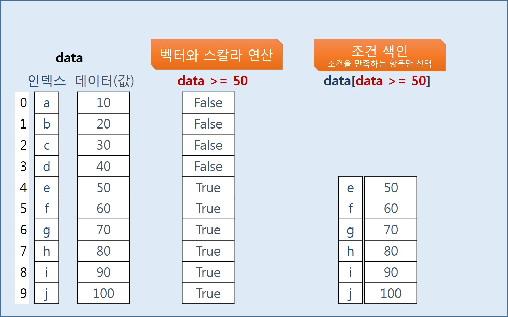

# Series

## Series ?


### Series 생성

```python
import random
from pandas import Series

sample = random.sample(range(1,100) , 26) # 1~100의 숫자중 26개를 뽑는다. --> 리스트
data = Series(sample , index = list('ABCDEFGHIJKLMNOPQRSTUVWXYZ'))
# Series는 1차열 배열과 비슷하다. 생성시에는 List로 받으며, index를 지정할 수 있다.

```

### Series 인덱스

#### 인덱스 슬라이싱 \(숫자 인덱스\)


1\) :을 기점으로 왼쪽에 start index, 오른쪽에 end index 지정

2\) start index 보다 크거나 같고, end index보다 작은 항목을 선택

3\) 예를 들어, a\[2:5\]는 a\[\[2,3,4\]\]와 동일

4\) start index와 end index는 생략 가능하며, 생략 시 start index는 첫 인덱스, end index는 끝 인덱스로 지정됨.

5\) 음수 인덱스는 끝에서 시작되는 역인덱스임.

#### 조건을 활용한 인덱스 선택 \(조건 색인\) 매우 많이 활용되므로, 꼭 알고 있어야 함!



### Series 속성 조회 및 주요 함수


```python
# 1) 인덱스 라벨이 'K' 항목의 값 출력
data['K']

# 2) 인덱스 라벨이 'A','F','C' 항목의 값 출력 , 여러개의 인덱스 참조는 리스트 형태로 넣어줘야함.
data[['A','F','C']]

# 3) 5번 인덱스부터 15번 인덱스까지의 항목 출력
data[5:16]

# 4) 뒤에서 5개 항목 출력
data[-5:]

# 5) data의 항목의 갯수를 출력
len(data)
data.size

# 6) data 항목 값들의 평균보다 큰 항목만 출력 
## Hint. data 항목 값들의 평균은 data.mean()으로 구할 수 있다.
data[data.mean() < data]

# 7) data의 항목 값 중에 50이 있는지 확인하여, 있으면 True, 없으면 False를 출력
if data[data == 91].size > 0 :
    print(True)
    
# 8) data의 인덱스 라벨과 각 항목 값을 아래와 같이 출력
# index: A, value: XX
# index: B, value: XX
# index: C, value: XX

for i in range(0,data.size) :
   print("index :", data.index[i] , "value : ", data[i])

```

